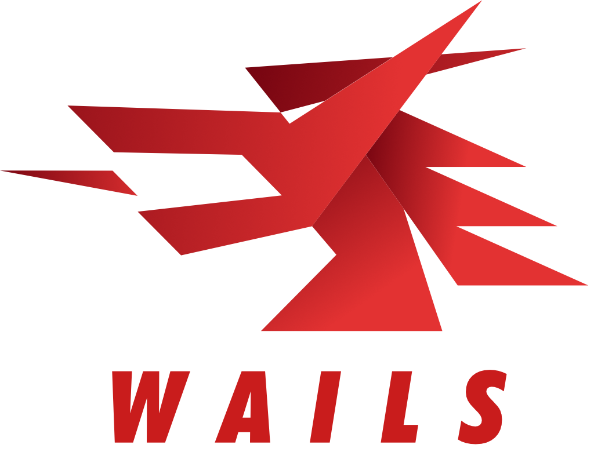

# Ducke

<p align="center">
  <strong>Менеджер удаленных игровых репозиториев и центр метаданных Steam</strong><br>
  <em>Разработан для портативных и настольных ПК — нативная интеграция со Steam Deck и SteamOS 3.8+</em>
</p>

<p align="center">
  
</p>

<p align="center">
  
  
  
  
  
</p>

---

## Основные возможности

- **Два режима интерфейса**:
  - **Big Picture (10-Foot Mode)**: Удобное управление с геймпада, оптимизированное для Steam Deck, портативных консолей и экранов ТВ. Поддерживает нативное разрешение 1280x800, звуковые эффекты навигации, управление стиками/крестовиной и автоматический вызов экранной клавиатуры SteamOS по нажатию `(X)`.
  - **Классический вид (Desktop Mode)**: Двухпанельный каталог с мгновенным поиском, фильтрацией по жанрам и детальной информацией.
- **Высокопроизводительный загрузчик**:
  - Многопоточная загрузка фрагментов файлов с возможностью паузы и докачки.
  - Ограничение скорости (Bandwidth Limiter) и очередь одновременных загрузок.
  - Мониторинг скорости в реальном времени, расчет оставшегося времени (ETA), учет свободного места на диске и пул переиспользуемых буферов памяти.
  - Поддержка протоколов **SFTP (SSH)** и **FTP** со сканированием каталогов и структурированием загрузки.
- **Интеграция со Steam и SteamGridDB**:
  - Автоматическая очистка названий релизов и интеллектуальный нечеткий поиск (fuzzy matching) по базе Steam.
  - Загрузка скриншотов в высоком разрешении и встроенный плеер трейлеров (HLS / DASH / MP4).
  - Отображение оценок Metacritic, отзывов игроков, системных требований, жанров и дат релизов.
  - Качественные обложки со SteamGridDB (вертикальные постеры, горизонтальные баннеры, прозрачные логотипы).
- **Импорт из FileZilla**:
  - Быстрый импорт списка серверов из файла экспорта `FileZilla3.xml`.
- **Полная поддержка SteamOS и Steam Deck**:
  - Готовый Flatpak-манифест со встроенным аппаратным ускорением видео (`WebviewGpuPolicyAlways`).
  - Совместимость с композитором Gamescope, Wayland и X11.
  - Доступ к картам памяти MicroSD (`/run/media/...`), накопителям и системным папкам.

---

## Стек технологий

- **Бэкенд**: [Go](https://go.dev/) 1.25, [Wails v2](https://wails.io/), [modernc.org/sqlite](https://gitlab.com/cznic/sqlite) (чистый Go SQLite без необходимости CGO на Windows).
- **Фронтенд**: [Svelte 5](https://svelte.dev/), [TypeScript](https://www.typescriptlang.org/), [Vite](https://vitejs.dev/), [TailwindCSS v4](https://tailwindcss.com/), [Lucide Svelte](https://lucide.dev/).
- **Сетевые протоколы**: `golang.org/x/crypto/ssh`, `github.com/pkg/sftp`, `github.com/jlaffaye/ftp`.

---

## Структура проекта

```
Ducke/
├── app.go                  # Связующий слой Wails API между Go и Svelte
├── main.go                 # Точка входа в приложение и параметры окна
├── wails.json              # Конфигурационный манифест Wails
├── pkg/
│   ├── config/             # Настройки приложения, профили серверов, парсер FileZilla XML
│   ├── database/           # SQLite база данных, кэш игр, история загрузок
│   ├── downloader/         # Движок передачи файлов, очередь, лимитер скорости, пул буферов
│   ├── logger/             # Логирование и системная диагностика
│   ├── metadata/           # Клиенты Steam Store API и SteamGridDB, сопоставление названий
│   └── remote/             # Клиенты подключения и обхода каталогов FTP/SFTP
├── frontend/               # Фронтенд на Svelte 5 + TypeScript + Vite
│   └── src/
│       ├── lib/components/ # Представления: Каталог, Детали, Загрузки, Настройки
│       │   └── bigpicture/ # Компоненты 10-футового режима Big Picture
│       └── lib/navigation/ # Движок управления геймпадом и звуковая обратная связь
└── build/                  # Сборочные скрипты и манифесты (Windows NSIS, Linux Flatpak, macOS)
    └── linux/              # Скрипты SteamOS, Flatpak манифест, .desktop файл
```

---

## Требования для разработки

1. **Go**: версия 1.22+ (рекомендуется 1.24 или 1.25)
2. **Node.js**: версия 18+ и пакетный менеджер npm
3. **Wails CLI**:
   ```bash
   go install github.com/wailsapp/wails/v2/cmd/wails@latest
   ```

### Запуск в режиме разработки (Live Dev)

```bash
# Клонируйте репозиторий
git clone https://github.com/<ваш-логин>/ducke.git
cd ducke

# Запуск с горячей перезагрузкой (Vite HMR + пересборка Go)
wails dev
```

---

## Сборка релизных версий

### Сборка под Windows (EXE)

```bash
# Сборка оптимизированного исполняемого файла под Windows AMD64
wails build -platform windows/amd64

# Собранный файл будет находиться в:
# build/bin/Ducke.exe
```

### Сборка под Linux и Steam Deck (Flatpak)

Для автоматической сборки Flatpak-пакета (`Ducke.flatpak`) и бинарника на Windows через WSL (Ubuntu 22.04):

```cmd
# Запуск автоматического сборочного скрипта
build_linux.bat
```

Либо напрямую в окружении Linux с установленными `flatpak-builder` и `webkit2gtk-4.1`:

```bash
chmod +x build_linux.sh
./build_linux.sh
```

Готовые файлы появятся в директории `build/bin/`:
- `Ducke.flatpak` — автономный установочный пакет для SteamOS / Flathub runtime.
- `Ducke` — нативный исполняемый файл Linux AMD64.
- `install_steamdeck.sh` — скрипт установки в один клик для рабочего стола Steam Deck (Desktop Mode).

Подробная инструкция по установке и добавлению в игровой режим SteamOS доступна в файле [docs/STEAM_OS.md](docs/STEAM_OS.md).

---

## Тестирование

```bash
# Запуск Go тестов
go test ./...

# Проверка типов фронтенда
cd frontend
npm run check
```

---

## Лицензия

Проект распространяется под свободной лицензией MIT. Подробности см. в файле [LICENSE](LICENSE).
